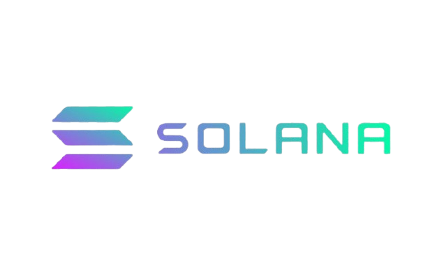

<div align="center">
  
  <h2>Solana Programs Collection</h2>
</div>

A curated, open-source collection of well-structured **Solana program implementations**.
This repository is intended as a learning resource and reference for on-chain development,
covering multiple frameworks and patterns.

---

## Repository Structure

Programs are grouped by framework and implementation style.

```

programs/
├── native/        # Native Rust Solana programs
├── anchor/        # Anchor framework programs
├── pinocchio/     # Pinocchio-based programs

```

Each program lives in its own directory and is self-contained, including:
- program source code
- tests
- minimal documentation

---

## Program Status

Implementation progress is tracked using long-living **tracker issues**:
- Native Solana programs
- Anchor programs
- Pinocchio programs

Refer to the GitHub issues tab to see what is implemented and what is currently in progress.

---

## Contributing

Contributions are appreciated!

Please read **[CONTRIBUTING.md](CONTRIBUTING.md)** before starting work.
It explains:
- repository conventions
- commit message format
- how tracker issues and pull requests are handled

---

## License

This project is licensed under the **MIT License**.
See the [LICENSE](LICENSE) file for details.
